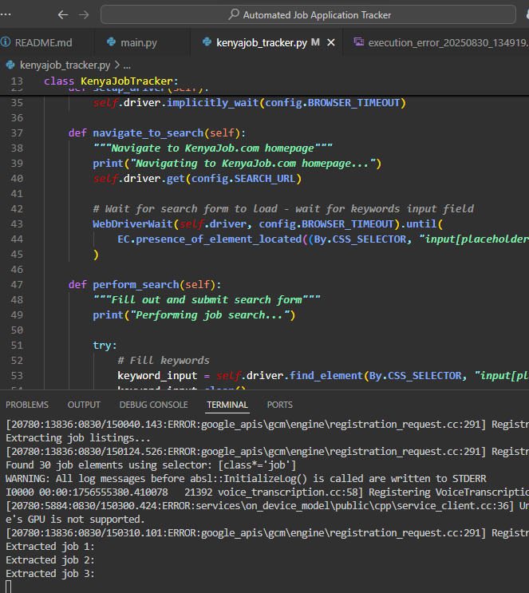

# 🚀 KenyaJob.com Job Application Tracker



A powerful Selenium-based automation tool specifically designed to track job applications on KenyaJob.com, one of Kenya's leading job portals. Streamline your job search process with automated tracking and reporting.

## 📋 Table of Contents

- [Features](#-features)
- [Skills Demonstrated](#-skills-demonstrated)
- [Quick Start](#-quick-start)
- [Installation](#-installation)
- [Configuration](#-configuration)
- [Usage](#-usage)
- [Output](#-output)
- [Screenshots](#-screenshots)
- [Project Structure](#-project-structure)
- [Contributing](#-contributing)
- [License](#-license)

## ✨ Features

| Feature | Description |
|---------|-------------|
| 🔍 **Automated Search** | Navigates and searches KenyaJob.com automatically |
| 🎯 **Customizable Criteria** | Search by keywords, location, and category |
| 📅 **Smart Filtering** | Filters recent job postings (configurable days) |
| ⏰ **Date Parsing** | Handles relative dates like "X days ago", "today" |
| 📊 **Application Tracking** | Tracks applications with timestamps |
| 💾 **CSV Reports** | Generates comprehensive CSV reports |
| 📸 **Debugging Screenshots** | Captures screenshots for troubleshooting |
| 🎨 **Configurable** | Easy customization through config.py |

## 🛠️ Skills Demonstrated

- **Web Automation**: Selenium automation on real-world websites
- **Dynamic Element Handling**: Robust handling of dynamic web elements and forms
- **Data Processing**: Advanced date parsing and data transformation
- **Error Handling**: Comprehensive exception management in automation
- **Data Management**: pandas for efficient data handling and reporting
- **Report Generation**: Professional CSV report creation

## 🚀 Quick Start

### Prerequisites
- Python 3.7+
- Chrome browser
- ChromeDriver in PATH

### Installation

1. **Clone the repository** (if applicable)
2. **Install dependencies**:
   ```bash
   pip install -r requirements.txt
   ```

3. **Download ChromeDriver** and add it to your PATH

4. **Configure your search** in `config.py`:
   ```python
   KEYWORDS = ["software developer", "python developer"]
   LOCATION = "Nairobi"
   CATEGORY = "IT & Telecoms"
   ```

5. **Run the tracker**:
   ```bash
   python main.py
   ```

## ⚙️ Configuration

Customize your job search in `config.py`:

```python
# Search Criteria
KEYWORDS = ["software developer", "python developer", "web developer"]
LOCATION = "Nairobi"
CATEGORY = "IT & Telecoms"

# Search Parameters
MAX_LISTINGS = 50    # Maximum job listings to extract
DAYS_RECENT = 7      # Only show jobs from last X days

# Output Settings
OUTPUT_DIR = "output"
LISTINGS_CSV = "job_listings.csv"
APPLICATIONS_CSV = "applications_tracker.csv"
SCREENSHOTS_DIR = "screenshots"

# Browser Settings
HEADLESS = False     # Set True to run browser in background
BROWSER_TIMEOUT = 30 # Seconds to wait for page elements
```

## 🎯 Usage

### Basic Usage
```bash
python main.py
```

### Test Mode (Limited Listings)
```bash
python main.py --test
```

### Custom Search
```bash
python main.py --keywords "data scientist" --location "Mombasa" --category "Data Science"
```

### Headless Mode
```bash
python main.py --headless
```

## 📊 Output

After running the tracker, check the `output/` directory for:

- **`job_listings.csv`** - All extracted job opportunities with details
- **`applications_tracker.csv`** - Your application tracking data with timestamps

Screenshots for debugging are saved in the `screenshots/` directory.

## 📸 Screenshots

The tool captures screenshots during execution for debugging purposes. Example screenshots include:

- Search page navigation
- Job listing extraction
- Application process
- Error scenarios

## 📁 Project Structure

```
Automated Job Application Tracker/
├── main.py              # Main entry point with CLI arguments
├── kenyajob_tracker.py  # Core Selenium automation logic
├── config.py            # Configuration settings
├── requirements.txt     # Python dependencies
├── README.md           # This file
├── image.png           # Project logo/banner
├── TODO.md             # Implementation progress and roadmap
├── output/             # Generated CSV reports
│   ├── job_listings.csv
│   └── applications_tracker.csv
└── screenshots/        # Debugging screenshots
    ├── execution_error_*.png
    └── search_error_*.png
```

## 🤝 Contributing

We welcome contributions! Here's how you can help:

1. Fork the repository
2. Create a feature branch: `git checkout -b feature/amazing-feature`
3. Commit your changes: `git commit -m 'Add amazing feature'`
4. Push to the branch: `git push origin feature/amazing-feature`
5. Open a Pull Request

### Areas for Contribution
- Website-specific CSS selector improvements
- Additional job portal integrations
- Enhanced data extraction features
- UI/UX improvements
- Testing and documentation

## 📄 License

This project is open source and available under the [MIT License](LICENSE).

## ⚠️ Important Notes

- Ensure ChromeDriver is properly installed and in your PATH
- Internet connection is required for web scraping
- Respect website's robots.txt and terms of service
- Consider adding delays between requests to avoid server overload
- The current implementation may need CSS selector adjustments based on KenyaJob.com's actual HTML structure

## 🆘 Support

If you encounter any issues:

1. Check the `screenshots/` directory for error screenshots
2. Verify ChromeDriver installation
3. Ensure all dependencies are installed
4. Check your internet connection

For additional help, please open an issue with:
- Error messages
- Screenshots of the issue
- Steps to reproduce

---

**Happy job hunting!** 🎯

*Automate your job search and focus on what matters - preparing for interviews!*
